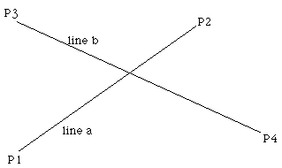

## Intersection point of two line segments in 2 dimensions

The equations of the lines are

**Pa = P1 + ua ( P2 - P1 )**

**Pb = P3 + ub ( P4 - P3 )**

Solving for the point where **Pa = Pb** gives the following two equations in two unknowns (ua and ub)

**x1 + ua (x2 - x1) = x3 + ub (x4 - x3)**

**y1 + ua (y2 - y1) = y3 + ub (y4 - y3)**

Solving gives the following expressions for ua and ub

**x = x1 + ua (x2 - x1)**

**y = y1 + ua (y2 - y1)**

**Notes:**

- The denominators for the equations for ua and ub are the same.

- If the denominator for the equations for ua and ub is 0 then the two lines are parallel.

- If the denominator and numerator for the equations for ua and ub are 0 then the two lines are coincident.

- The equations apply to lines, if the intersection of line segments is required then it is only necessary to test if ua and ub lie between 0 and 1. Whichever one lies within that range then the corresponding line segment contains the intersection point. If both lie within the range of 0 to 1 then the intersection point is within both line segments. 
